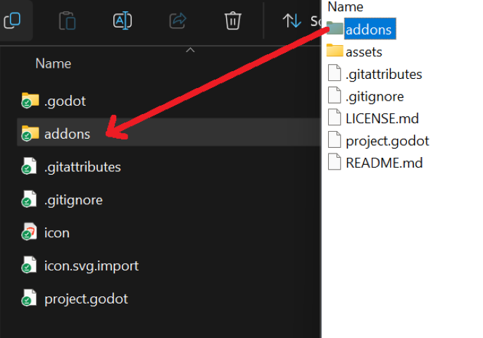
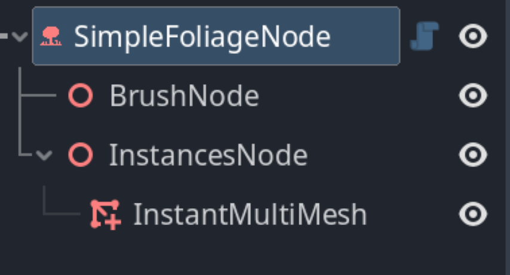
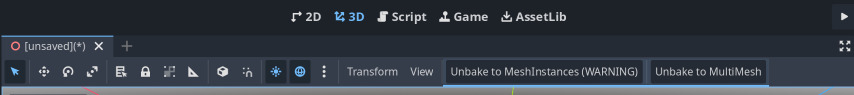

# Tutorial for Simple Foliage Painter plugin

## Installation
- Download the plugin from [RELEASES](https://github.com/AdisonHub/Simple-Foliage-Painter-Plugin/releases) and move addons folder to your project

- Enable plugin in Godot in Project>Settings>Plugins

## Getting Started
- Prepare your scene in which you want to paint the meshes
You should have your scene ready, in case you just want to try the features, you can find example terrain and foliage meshes in addons>simple_foliage_painter>examples
- Prepare meshes / colliders of objects you want to paint
You can save your meshinstances you want to paint by "save as" option in an inspector  
  
- add SimpleFoliageNode to your scene by sellecting "+" under your scene tab and searching for SimpleFoliageNode (you can add multiple SimpleFoliageNodes to your scene)  
  
- to activate it reselect (deselect and select it again) the node in scene tab  
  
## Overview
- **Viewport buttons**
You should now see 2 checkboxes and 3 buttons on yop of your 3d Viewport:  
  
- Erase checkbox makes the brush erase meshes instead of painting them, you can also use "E" key to toggle erase option
- Instant Multimesh checbox determines if you paint your instances to single multimesh or maint individual meshinstances - it can be selected only before you start painting anything, it's not possible to place both multimesh and meshinstances under single SimpleFoliageNode
    - checked box (default) makes single multimesh, which is crucial if you're going to paint thousands of instances of selected mesh, eg. grass, but it doesn't allow you to adjust each painted instance in editor by hand  
      
    - unchecked box makes you paint single meshinstances, which allows you to adjust (move/rotate/remove/duplicate) each painted meshinstance before baking. But if you're going to paint thousands of those meshes it may cause noticeable slowdown of godot editor  
      
- Delete All button deletes all of already painted meshinstances or the multimesh (Warning- there is no undo button!) and brings back Instant Multimesh checkbox
- Refresh button is used after you've changed your mesh but the placed meshes didn't update for some reaso, normally you shouldn't need to use it
- Bake button generates tiles of multimeshes of each level of detail by the rules you've entered in the inspector panel and applies visibility ranges, making your foliage (or any other painted meshes) ready to use in game by hopefully making rendering of multiple meshes much more performant  
  
- **Viewport buttons after baking**
After selecting "Bake" button, you'll be able to see two buttons:  
  
- Unbake to MeshInstances (WARNING) button unbakes the baked multimesh tiles to separate MeshInstances so that you can paint more, erase or adjust each meshinstance by hand, use this option carefully, hence the WARNING, because if you try to use this button with several thousands of instances, depending on your hardware, godot might crash or freeze
- Unbake to MultiMesh unbakes the multimesh tiles to single MultiMesh allowing you to paint more or erase instances with brush
- **Inspector tab**
In the inspector tab you can see several options:  
  
- Brush settings impact your brush
    - Amount means the amount of instances placed wth each stroke - small instances such as grass may require more amount to achieve satisfactional coverage, bigger brush requires more amount for the same coverage as smaller brush
    - Brush size base is the diameter of your brush
    - Paint collision layer - this option allows you to choose on which collision layer the brush can paint - choose the same collision layer on your terrain mesh you want to paint on, leave this collision layer free for meshes you don't want to allow painting on
    - Align with surface checkbox determines if oainted mesh will be alighed with surface (checked) or positioned straight up (unchecked). This option should be checked for assets like grass or bushes and unchecked for trees, with both examples presented on photo below:  
   
 - Mesh Settings allow you to choose meshes you want to scatter - up to 3 levels of detail. LOD 0 has to be choosen, the rest you can leave free. If you want to try meshes included with addon, select folder icon close to each mesh and check addons checbox in file explorer.  
   
  - Baking settings - the only available option is tile size - it determines the edge size of a square tiles of baked multimeshes - you should choose it so that it contains multiple meshes - for grass smaller tile size like 10 or 15 will be sufficient, for trees or other big assets you can try to use bigger tiles in range of 20-30, but you can playwith this option to balance performance and visuals
  - Collision Settings group allows you to place colliders for each painted instance
    - Collision shape option allows you to create or select collision shape, example one for tree is provided with plugin. You can also leave it free so the collision shapes will not be generated. Be aware that the colliders are ALWAYS rendered, even if each instance is not visible, so they're quite expensive in large quantities. Use colliders only if necessary
    - Foliage Collision Layer option allows you to choose collision layer of placed staticbodies containing your colliders
- LOD Visibility ranges allow you to choose visibility ranges of each baked multimesh tile, for grass you want to make it shorter, for big assents like trees- longer
    - LOD Visibility overlap option is used to overlap visibility ranges - if you're having no issues with visibility of baked multimeshes, just leave it at 0
    
## Step by step
OK, so now with the knowledge gained by overview of all options and buttons we can list each step needed to create some foliage:
1. Add SimpleFoliageNode to your scene containing terrain you want to paint on
2. Reselect SimpleFoliageNode to activate it's buttons
3. Select meshes you want to paint in Mesh Settings group in Inspector tab (at least LOD0 needed)
4. Select the same collision layer in Brush Settings and in StaticBody node of your terrain you want to paint on
5. Adjust other brush settings to your needs
6. Decide if you want to paint with instant MultiMesh (if unsure leave this checked)
7. Start Painting using your brush by Left Mouse Button
8. After painting you can adjust Baking settings (tile size), LOD Visibility Ranges and Collision Settings in Inspector tab
9. Select Bake button on top of the Viewport
10. If your foliage disappeared, it means your camera is too far from terrain, scroll closer ti it an you should start seeing your painted meshes
11. You can choose on of Unbake options to adjust inspector options or paint/erase meshes and bake again to apply your changes and bake them to multimesh grid
## Changing visibility ranges in code
- To change visibility ranges during gameplay by code, you can access method apply_lod_visibility_ranges() on specified SimpleFoliageNode as shown on an example below:  
   
## Known issues and limitations
- It's hard to paint single instance of an object, if you want to do it, select the smallest brush size with amount 1 and while holding LMB try to move the brush by only one pixel, it should place only one instance
- Sometimes the buttons on top of the editor don't refresh when they should - if you see incorrect buttons/checboxes you can try one of those solutions:
    - Deselect and select your SimpleFoliageNode again
    - Use the previously used button again
